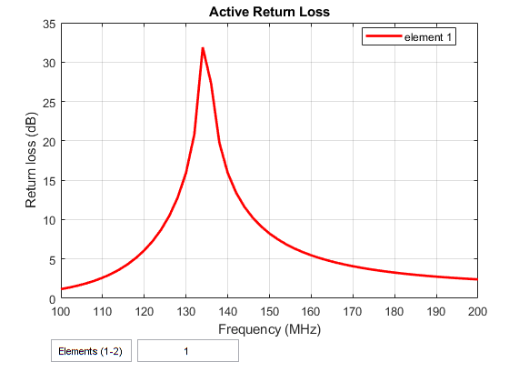

# 137MHz V-Dipole
Designs for a 137MHz antenna capable of picking up NOAA|Meteor|GOES satellites.

CAD files are designed and simulated in CST Microwave Studio 2015. Design based on the [Adam-9A4QV](https://www.dropbox.com/s/6fpfn2p9filc9ol/DIY%20137MHz%20WX-sat%20V-dipole%20antenna.pdf)

## Radiation Pattern

## Farfield Render

# 137MHz Cycloid Dipole

An omnidirectional, circularly polarized antenna tuned for 137MHz by MATLAB's Antenna Toolbox.

## Simulations
### Antenna Render

### Farfield Simulation

### Azimuth Radiation Pattern

### Elevation Radiation Pattern

### Current Intensity

### Impedance

### S-Parameters

# 137MHz Turnstile Dipole

An omnidirectional, circularly polarized antenna tuned for 137MHz by MATLAB's Antenna Toolbox.
## Simulations
### Antenna Render

### Farfield Simulation

### Azimuth Radiation Pattern

### Axial Ratio

### Return Loss

